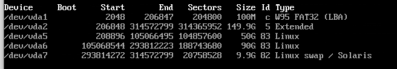

#### partitioniong
`sudo fdisk /dev/vda`

Formatteer tot het volgende:

Zie [passard's uitleg](./passard-vps-setup.md)

`mkfs.vfat /dev/vda1 -n boot`  
`mkfs.ext4 /dev/vda5 -L rootfs`   
`mkfs.ext4 /dev/vda6 -L datafs`  
`mkswap /dev/vda7 -L swap`  

#### Mounting
`mount /dev/vda5 /mnt`   
`mkdir /mnt/boot`   
`mount /dev/vda1 /mnt/boot`   
`mkdir /mnt/data`   
`mount /dev/vda6 /mnt/data`   

#### Network
`sudo systemctl start dhcpcd`


#### Installation
`pacstrap /mnt base`  
`genfstab -U /mnt >> /mnt/etc/fstab`  
`arch-chroot /mnt`  

#### Setup kernel options
`nano /etc/mkinitcpio.conf`  
Update line to `MODULES=(virtio virtio_blk virtio_pci virtio_net virtio_ring)` and save  
`mkinitcpio -p linux`  

Ignore the following warnings:  
```
== WARNING: Possibly missing firmware for module: wd719x  
== WARNING: Possibly missing firmware for module: aic94xx
```

#### Bootloader
`pacman --noconfirm -S grub`  
`grub-install --target=i386-pc /dev/vda`  
`grub-mkconfig -o /boot/grub/grub.cfg`  

#### Time 
`ln -sf /usr/share/zoneinfo/Europe/Amsterdam /etc/localtime`  
`hwclock --systohc`  

#### Locale
`nano /etc/locale.gen`  
Uncomment `en_US.UTF-8 UTF-8`  
`locale-gen`  

`nano /etc/locale.conf`  
LANG=en_US.UTF-8  

#### Hostname
`nano /etc/hostname`  

#### User
`pacman --noconfirm -S sudo`  
`useradd -m sijmen`  
`passwd sijmen`  
`nano /etc/sudoers`  
add `sijmen ALL=(ALL) NOPASSWD: ALL`  

#### SSH
`pacman --noconfirm -S openssh`  
`su sijmen`
`mkdir ~/.ssh`  
`chmod 700 ~/.ssh`
`nano ~/.ssh/authorized_keys`
add: `ssh-rsa AAAAB3NzaC1yc2EAAAADAQABAAACAQC/XA0bPMDydcKHmcFtikPDy/PQPxsx6L9fSA2bR8VqG50H1kS6gbdGCcTL+sPxD5yaprqabQ6Q6auj8vKoWMBUXAftvfyNy1mB6uanD1LBXi+GwfrtegeKg8FK0hcxL4rWJsrTS/LAEFCaYXW0jEb3HoyYhmHpzyNtKu3VDvb3hR7jcWD4epTBETpd+vmHv6Ak0ULnqIdJ2E9i4F9W0gmZMuCvcFPbge1YJO2gglzJ89luG9xvxgJ24bY07U1LH8eR5Y5YMrGPKdO8chtT4nzruYhHIxfcpGxT+WMSmFq3+D+MAGfqD3+dBgdbHsHx+JxSNO9fDTbgqon2Uf0IaNPAVKQ7xLUxw/CNkCgepvOV8qdNV8RZXG68u9NyVg/I1y53E0wz7VvsHcewnsDIxGidQ1m2fqwJV2Ybaz4VPVhizwYK5InGWuCZ6cRHMPGeno8DBFFiDfjRSiNkbYWqOytZ4WcrEydpbGrWL/VvpiXj609to9RxRMGjEVwQ6FJuFACcABTjXDIQ+tKR5JcDTJg2xC7hvesuisJTZdaBWqMmG3bHZUONtYPGRNiqq3VYYHXoIUJ44yLoVhPrz4RsfGisbjSK6hltLRrsH3S5LXgFtz9GArNW77aPw0E8rQPEekKG204Ssp3r6M9FxfozUHiBFtIy4OjAHxNCdwe3PSu2UQ== sijmenhuizenga@gmail.com`
`chmod 400 ~/.ssh/authorized_keys`
`sudo nano /etc/ssh/sshd_config`
 - PubkeyAuthentication yes
 - PermitRootLogin no
 - PasswordAuthentication no
 - PermitEmptyPassword no
 - UsePAM no
 
